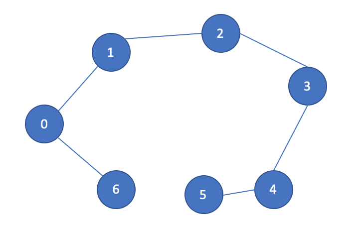

# Problem 1: Careers
<i>Note: writing only, no code required</i>

Refer to the jobs in Slide 8 of lecture: https://docs.google.com/presentation/d/12SzDspzzCMxQyhrXhFZTRElWz3bHM1KB/edit?usp=sharing&ouid=110578576214743957709&rtpof=true&sd=true 

Fill out the following table for programming/engineering jobs. For instance, you might use the following links for the data analyst position.

https://g.co/kgs/TLZzke 

https://www.payscale.com/research/US/Job=Data_Analyst/Salary 

```
| Job Title          	| Link to NYC Job Posting 	| List of Technologies Used 	| Expected Salary 	| Link for Salary Source 	|
|--------------------	|-------------------------	|---------------------------	|-----------------	|------------------------	|
| Data Analyst       	|                         	|                           	|                 	|                        	|
| Front-end Engineer 	|                         	|                           	|                 	|                        	|
| Back-end Engineer  	|                         	|                           	|                 	|                        	|
| Data Engineer      	|                         	|                           	|                 	|                        	|
```

# Problem 2: BSTs
Return the smallest node of a BST. (Note that only trees 0, 1, and 2 are BSTs.)


# Problem 3: Adding Arguments to Tree Traversals I
Refer to the SourceLeafPaths class covered in lecture.

Let a "TreePath" be the length from a root to a leaf. Define the length of such a path to be the sum of all nodes in
the path. Find the minimum TreePath for a given tree. (Suggestion: use a preorder traversal to find the lengths of 
all such paths, and return the min.)


# Problem 4: Adding Arguments to Tree Traversals II
Refer to the SourceLeafPaths class covered in lecture and LinkedList traversals from earlier homeworks.
1. Create a function, `findPathsSkip`, which only adds every other node to the paths returned. One method is to pass
a boolean, "shouldAdd", which is true or false each time.
2. Create a function, `findPaths`, that takes in an integer of the number of nodes to skip. For instance, 0 indicates to
skip no nodes, 1 indicates you should skip every other node, 2 indicates you should return every 3rd node.


# Problem 5: Returning Values from Tree Traversals
Look at SumTree under the lecture module of this repo. Notice that the way a sum is computed is by first
computing the sum of all child nodes, then adding to the current node value.

Now, take a look at the tests under Problem5Tests.java. The purpose of this problem is to write code which
can calculate the result of a computational tree. In this instance, the value of the tree is either "+", "\*", or an
integer. If "+", add the results of the left and right nodes, or for "\*", multiply them.

You may assume the tree is well-formed, i.e. that integers are only found at the tree leaves.


# Problem 6: Graphs Warm Up 
<i>Note: writing only, no code required</i>

1. Consider the BFS traversal given in GraphRunner.java, and refer to the image of the graph.
What are four possible edges (connecting lines) you could add to the graph which 
would make the `5` get printed before the `4`?

Do not modify the code in `BFS` at all, but you may check your answer by adding edges in `main`.

2. If you remove one node from this graph, the output is the same as a DFS. What node is it?

